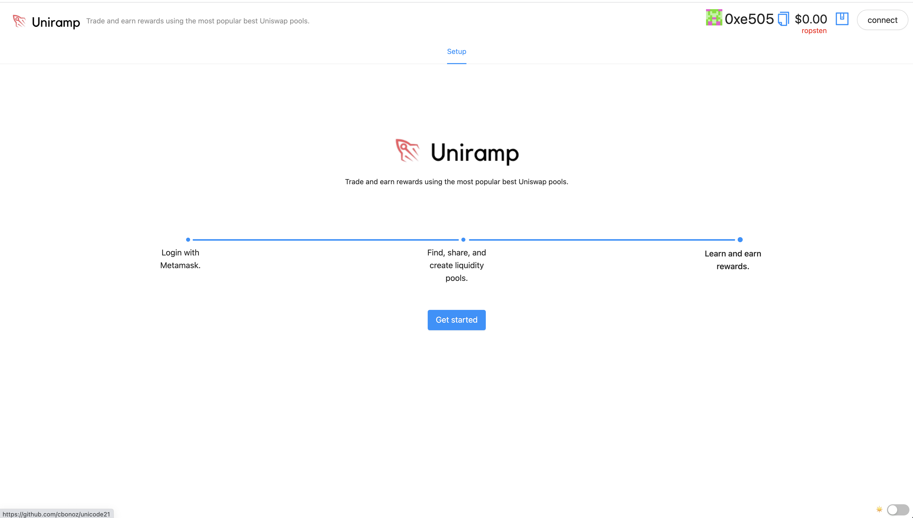
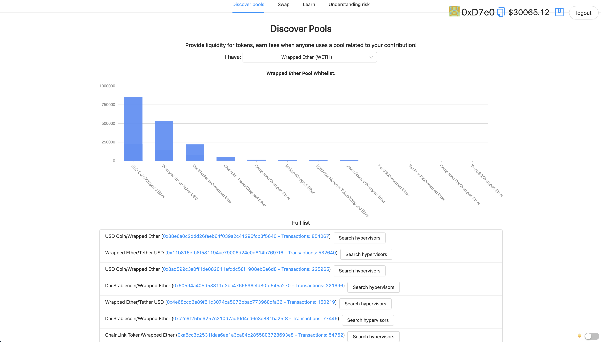
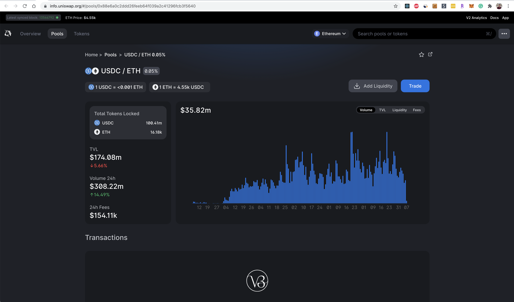
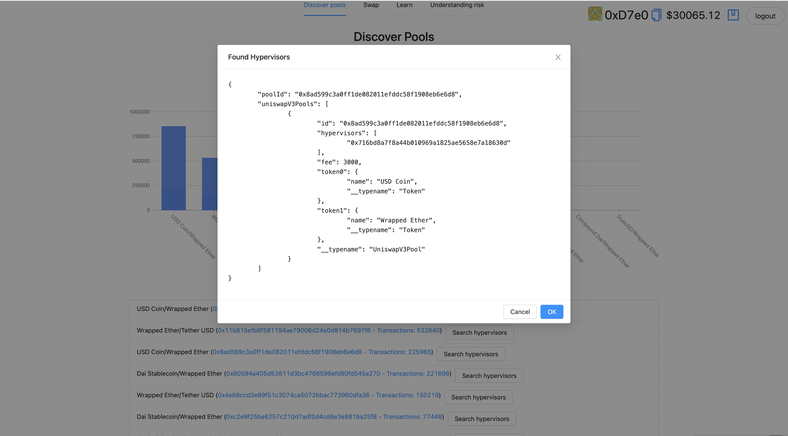
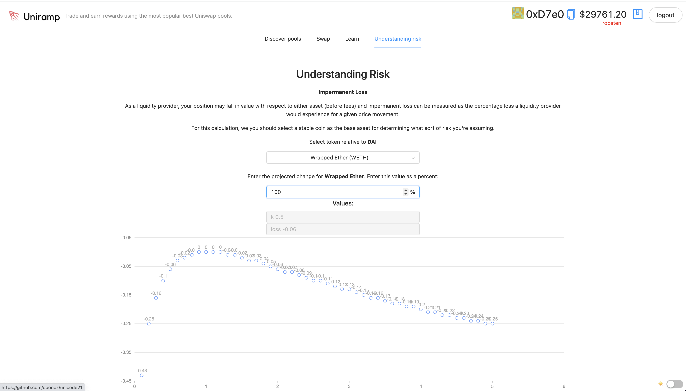
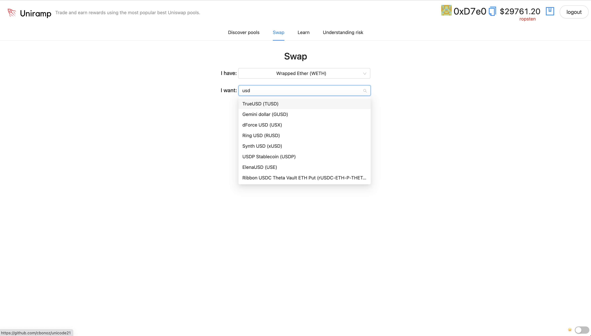
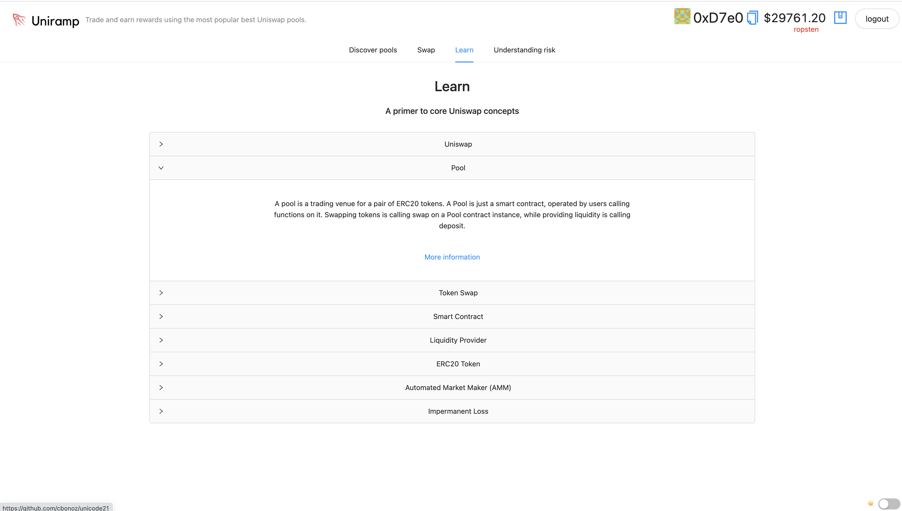
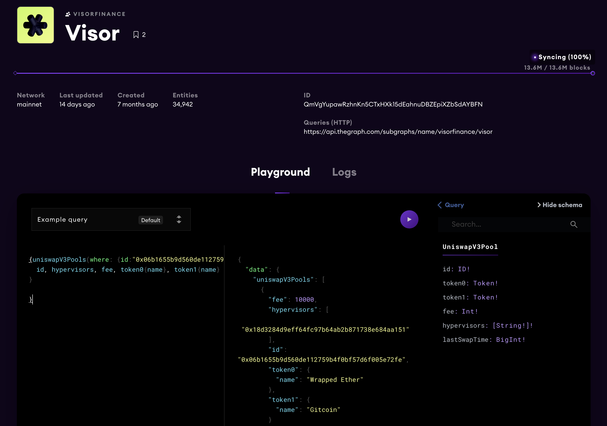
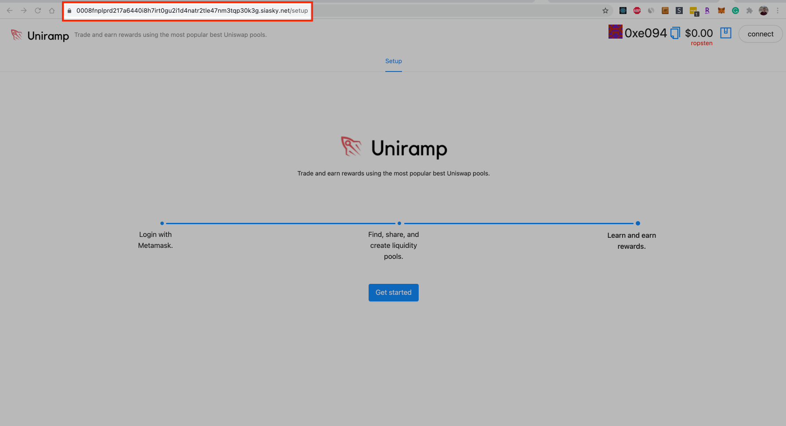
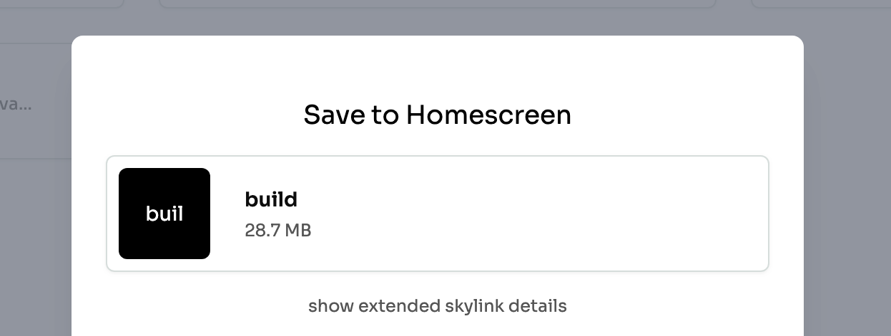

    

## Uniramp

Uniramp is an onboarding and education platform for new uniswap users designed to get them interacting and creating their own liquidity pools with minimal friction.

A liquity pool explorer/education platform.

https://unigrants.notion.site/RFPs-Challenges-3be614ba4e504b5caeee7b0159e64a42

Going after the UNI Documentation and Onboarding + Inclusion and access categories.

You can try the first version yourself here:

<a href="https://0003rg0rq551tpuq34hl6cc5glvpjnmqcjosnh68k10qboftvkbb3to.siasky.net" target="_blank">Deployed on Siasky</a>

Trade, earn, and learn.

<!--

Demo flow:
* Chris, Boston, Uniramp
* Liquity explorers exist but are not approachable for new users (ex: https://defirating.finance/en/pools/, not sure what to do with this information)
* https://info.uniswap.org/#/
* https://unigrants.notion.site/RFPs-Challenges-3be614ba4e504b5caeee7b0159e64a42
* Just the beginnings
* As a new user, I'm not looking for pools or tokens right away - I'm thinking trading and earning.
* Uniramp
* There's a lot of pools, anyone can create a pool. New users w
* Future work:
- Integrated app rewards and learning programs
- Integrated pool creation
- Rather than recreating some of the uniswap concepts. Onboard and tie into that existing functionality.
- Suite of visualization tools possible
* End with code/repo

Sponsors:
Uniswap (get users to get comfortable with pools and swapping tokens). - mainly the graph, need to add metamask interaction.
Visor (invest your assets for visor rewards). - purely visualization with the graph
Polywrap (optional)
Skynet (deployment)

* https://showcase.ethglobal.com/unicode/prizes
-->

### Screenshots

Home screen

Find the top whitelisted pools for each uniswap-supported token

Drill into Uniswap's existing detail view for discovered pools

Access existing hypervisors for the given pool / trading pair

Better understand assumed risk when providing liquidity

Swap tokens from Uniramp with a simple interface

Learn core Uniswap concepts directly from the app.

Example graphql query powering recommended hypervisors for a given Uniswap pool.

Hosted version on Siasky.

Add build to homescreen

### Running the project

In the project directory, you can run:

### `yarn start`

Runs the app in the development mode.\
Open [http://localhost:3000](http://localhost:3000) to view it in the browser.

The page will reload if you make edits.\
You will also see any lint errors in the console.

### `yarn test`

Launches the test runner in the interactive watch mode.\
See the section about [running tests](https://facebook.github.io/create-react-app/docs/running-tests) for more information.

### `yarn build`

Builds the app for production to the `build` folder.\
It correctly bundles React in production mode and optimizes the build for the best performance.

The build is minified and the filenames include the hashes.\
Your app is ready to be deployed!

See the section about [deployment](https://facebook.github.io/create-react-app/docs/deployment) for more information.

### Useful links

- https://ethglobal.notion.site/UniCode-Info-Center-0ba5eb0ebd384475850ec64a4bc5d257
- https://unigrants.notion.site/unigrants/UNICODE-Getting-Started-Guide-5f6cdf907a834f73aa28d2fde329d9c7
- https://thegraph.com/hosted-service/subgraph/ianlapham/uniswap-v3-testing?query=Pools
- https://docs.polywrap.io/guides/create-js-dapp/react-integration
- https://medium.com/auditless/how-to-calculate-impermanent-loss-full-derivation-803e8b2497b7
